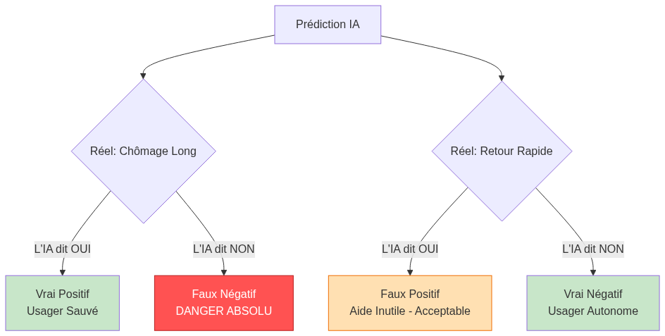

<!-- _class: lead -->
# Projet de Certification IA
## Système d'Orientation et de Prévention du Chômage Longue Durée

**Candidat : Franck Beugnet** — *Promo ATOS Atlas IA (Parcours 2 : Pros IT)*  
*Conception, industrialisation et audit d'un produit Data de bout en bout*

**Stack :** Python 3.12 · Scikit-Learn · LightGBM · FastAPI · Streamlit · MLflow · Prometheus · Docker

---

# Plan de la Soutenance (30 minutes cadencées)

1. **Cadrage Métier, Éthique & Objectifs (AI Act)** `[00:00 - 05:00 | 5 min]`
2. **Audit, Qualité & Pipeline End-to-End** `[05:00 - 10:00 | 5 min]`
3. **Modélisation, 4 Scénarios & Explicabilité (SHAP)** `[10:00 - 17:00 | 7 min]`
4. **Architecture Cible, Flux SI & Déploiement API** `[17:00 - 22:00 | 5 min]`
5. **Supervision MLOps, CI/CD & Dérive (Drift)** `[22:00 - 27:00 | 5 min]`
6. **Bilan Économique, Perspectives & Démonstration** `[27:00 - 30:00 | 3 min]`

---

# 1. Cadrage Métier & Objectifs

---

## Le Constat Métier

<style scoped>
section { font-size: 20px; padding-top: 70px; }
.columns { display: grid; grid-template-columns: 1fr 1.25fr; gap: 1.5rem; align-items: center; margin-top: 5px; }
ul { margin: 0 0 10px 0; padding-left: 20px; }
li { margin-bottom: 4px; }
</style>

<div class="columns">
  <div>
    <ul>
      <li><b>Contexte :</b> Flux massif d'usagers au 1<sup>er</sup> entretien.</li>
      <li><b>Objectif :</b> Aiguiller tôt vers l'accompagnement renforcé.</li>
      <li><b>Solution IA :</b> Modèle multimodal (tabulaire + <b>synthèse textuelle</b>).</li>
      <li><b>Cible (3 classes) :</b><br>
        • <b>0 (Rapide &lt; 6m) :</b> 37%<br>
        • <b>1 (Moyen 6-12m) :</b> 44%<br>
        • <b>2 (Risque long &gt; 12m) :</b> 18% <i>(critique)</i>
      </li>
    </ul>
    <div class="tech-box" style="font-size: 16px; margin-top: 8px; padding: 8px 10px; line-height: 1.3;">
      <b>Doctrine "No Mercy" sur le Risque :</b><br>
      Priorité absolue au <b>Rappel sur la classe 2</b> plutôt qu'à l'Accuracy. Prédire 0 pour un vrai 2 est une perte de chance humaine et financière inacceptable.
    </div>
  </div>
  <div align="center">
    
  </div>
</div>

---

## Cadre Réglementaire, RGPD & Responsabilité Juridique

<style scoped> section { font-size: 20px; } </style>

L'usage de l'IA dans l'orientation professionnelle impose un cadre de conformité strict :

1. **AI Act Européen (Classification Haut Risque — Annexe III) :**
   - Les systèmes d'IA utilisés dans l'emploi et l'orientation relèvent de la catégorie **Haut Risque**.
   - Exigences impératives : traçabilité des données, explicabilité, gouvernance des biais et **supervision humaine obligatoire (*Human-In-The-Loop*)**.
2. **Loi pour une République Numérique (Art. L311-3-1) :**
   - Droit pour l'usager à l'information et à l'explicabilité individuelle des règles algorithmiques appliquées.
3. **Responsabilité Juridique & Notion de "Perte de Chance" :**
   - Si un usager vulnérable est mal orienté (classé en retour rapide par erreur), il subit un préjudice (privation d'aides ou de formations). Devant le Tribunal Administratif, la **perte de chance** engage la responsabilité de l'administration.
   - **Protection juridique par conception :** L'outil est strictement qualifié d'**aide à la décision consultative**. L'agent public valide et endosse souverainement la décision finale.

---

# 2. Audit & Ingénierie des Données

---

## Le Défi de la Donnée : "Small Data", Cardinalité & Qualité

- **Jeu de données :** 2 500 profils usagers historiques, 10 variables, présence de valeurs manquantes (âge, diplôme, allocataire, texte).
- **Problème technique (Malédiction de la dimensionnalité) :**
  - `code_insee_commune` : > 2 400 communes distinctes pour 2 500 lignes.
  - `code_rome_vise` : > 50 métiers distincts.
  - Entraîner sur ces données brutes conduirait à un sur-apprentissage (*overfitting*) immédiat.

<div class="tech-box">
<b>Décision Technique : Extraction de Macro-Tendances</b><br>
Dérivation du <b>Département</b> (2 premiers caractères du code INSEE) et de la <b>Famille ROME</b> (1ère lettre).<br>
<b>Limites assumées de l'échantillon (2 500 lignes) :</b> En agrégeant par département, on sacrifie la granularité du bassin d'emploi local (pôle dynamique vs zone rurale isolée), compromis nécessaire pour éviter la mémorisation par cœur.
</div>

---

## La Sélection des Variables : Éthique & Biais (AI Act)

<style scoped>
section { font-size: 20px; }
ul { margin: 6px 0 10px 0; }
li { margin-bottom: 3px; }
</style>

- **Biais historiques constatés (EDA) :**
  - **Âge :** 29% des seniors (45-65 ans) en risque long vs 9% des 25-45 ans.
  - **Nationalité hors UE :** 38% en risque long vs 15% pour les ressortissants UE.
- **Risque légal (Disparate Impact) :** Risque de discrimination algorithmique sanctionnée par l'AI Act et la *Loi pour une République Numérique*.
- **Transparence :** Rédaction d'une **Datasheet for Datasets** (*Gebru et al.*) dans `data/DATASHEET.md`.

<div class="tech-box" style="font-size: 17px; margin-top: 8px; padding: 8px 12px; line-height: 1.35;">
<b>Décision Stratégique (Privacy by Design — Scénario S2) :</b> Retrait de l'Âge et de la Nationalité pour forcer le modèle à chercher les causes objectives (freins textuels, secteur, parcours).<br>
<b>Constat lucide (Échec du <i>Fairness through Blindness</i>) :</b> Les variables proxy (département, diplôme) réintroduisent un biais résiduel. D'où l'impératif du filet humain (HITL).
</div>

---

## Analyse du Texte (NLP) : Problématique et Possibilités

- **La Problématique :** La `synthese_entretien` est un champ libre, non structuré. C'est le **prédicteur n°1** du jeu de données (mots-clés : <i>freins périphériques, perte de confiance, autonome</i>).
- **Le Défi :** Transformer des notes hétérogènes en représentations numériques exploitables en temps réel.
- **Les Possibilités techniques :**
  1. *Bag of Words (Comptage brut)* : Bruit statistique, domination des mots vides.
  2. *Deep Learning (CamemBERT / Embeddings / LLM)* : Très lourd, approche "boîte noire", risque d'overfitting sur 2 500 textes courts, non aligné sur la sobriété numérique.
  3. *TF-IDF (Term Frequency - Inverse Document Frequency)* : Pondération de la rareté des termes.

---

## Notre Choix NLP : TF-IDF avec Stop Words Français

Nous avons retenu l'approche **TF-IDF filtrée** pour trois raisons déterminantes :

1. **Obligation Légale & Transparence (AI Act) :** Système 100% explicable. Chaque mot possède un poids direct traçable (ex: "barrière", "santé", "complexe").
2. **Robustesse sur Petit Volume :** Aucun risque d'explosion paramétrique contrairement aux réseaux de neurones. Espace vectoriel plafonné à 1 000 features avec filtrage `max_df=0.85` et stopwords français.
3. **Green IT & Temps Réel (Principe KISS) :** Inférence en moins de **0.1 ms sur simple CPU**, sans aucune dépendance à des infrastructures GPU coûteuses et énergivores.

---

## Le Pipeline Scikit-Learn End-to-End (Anti-Data Leakage)

Toute la chaîne est encapsulée dans un `Pipeline` Scikit-Learn sérialisé, assurant une **herméticité totale** et une utilisation immédiate en production :

$$\text{Données Brutes Usager} \longrightarrow \underbrace{\text{Feature Engineering}}_{\text{FunctionTransformer}} \longrightarrow \underbrace{\text{ColumnTransformer}}_{\text{Imputers, Scaler, OHE, TF-IDF}} \longrightarrow \underbrace{\text{Estimateur}}_{\text{LightGBM}}$$

- **Zéro Data Leakage :** Préparé et ajusté strictement après le `train_test_split` stratifié.
- **Entrées brutes acceptées :** L'API et les services aval injectent directement `code_insee_commune` et `code_rome_vise` sans prétraitement externe.

---

# 3. Modélisation, Scénarios & Explicabilité

---

## Le Défi du Déséquilibre : La Réalité des Données

<style scoped>
section { font-size: 21px; padding-top: 75px; }
.columns { display: grid; grid-template-columns: 1fr 1.25fr; gap: 1.5rem; align-items: center; }
ul { margin: 0 0 10px 0; padding-left: 20px; }
li { margin-bottom: 5px; }
</style>

<div class="columns">
  <div>
    <ul>
      <li><b>Répartition de la cible (3 classes) :</b><br>
        • <b>Classe 0 (Rapide &lt; 6m) :</b> 37%<br>
        • <b>Classe 1 (Moyen 6-12m) :</b> 44%<br>
        • <b>Classe 2 (Risque &gt; 12m) :</b> <b>18%</b> <i>(critique)</i>
      </li>
      <li><b>Le Piège de l'Accuracy :</b> Un modèle naïf prédisant 0 ou 1 obtient 81% d'Accuracy en abandonnant 100% des personnes à risque !</li>
    </ul>
    <div class="tech-box" style="font-size: 15px; margin-top: 8px; padding: 8px 10px; line-height: 1.35;">
      <b>Boussole unique (F1-Score Macro) :</b><br>
      C'est la note moyenne obtenue sur les 3 classes en donnant le même poids à chacune : si l'IA oublie la classe minoritaire à risque, sa note globale s'effondre.
    </div>
  </div>
  <div align="center">
    
  </div>
</div>

---

## Asymétrie des Coûts : Deux Leviers pour Réduire les Erreurs Critiques

<style scoped>
section { font-size: 19px; padding-top: 75px; }
.cost-grid { display: grid; grid-template-columns: 1fr 1fr; gap: 1.2rem; margin-top: 8px; }
.cost-card { background: #ffffff; border: 2px solid #1565c0; border-radius: 8px; padding: 10px 12px; }
.cost-card h3 { margin: 0 0 6px 0; font-size: 17px; color: #0d47a1; }
ul { margin: 0; padding-left: 18px; }
li { margin-bottom: 4px; font-size: 14.5px; line-height: 1.35; }
</style>

Classer un profil en risque (2) en retour rapide (0) est bien plus grave qu'une fausse alerte. Deux leviers :

<div class="cost-grid">
  <div class="cost-card">
    <h3>1. En Amont : À l'Entraînement (Cost-Sensitive Learning)</h3>
    <ul>
      <li><b>Pondération automatique — <code>class_weight='balanced'</code> (Retenu) :</b><br>
        Chaque profil à risque pèse ~2,4× plus lourd, forçant l'algorithme à ne pas l'ignorer.</li>
      <li><b>Poids personnalisés — <i>Custom Sample Weights</i> :</b><br>
        Possibilité de sur-pénaliser davantage les erreurs sur les demandeurs vulnérables.</li>
    </ul>
  </div>
  <div class="cost-card" style="border-color: #2e7d32;">
    <h3 style="color: #1b5e20;">2. En Aval : À la Décision (Cost-Sensitive Thresholding)</h3>
    <ul>
      <li><b>Seuil d'alerte préventif abaissé — <i>Decision Threshold Tuning</i> :</b><br>
        Déclencher l'aide dès 25% de risque détecté, sans attendre une certitude absolue.</li>
      <li><b>Seuil d'abstention (65%) — <i>Rejection Threshold (HITL)</i> :</b><br>
        En cas de doute, l'IA passe la main au conseiller humain (<i>Human-in-the-Loop</i>).</li>
    </ul>
  </div>
</div>

<div class="tech-box" style="font-size: 15px; margin-top: 10px; padding: 6px 12px; line-height: 1.3;">
<b>Synthèse :</b> On combine une pondération à l'apprentissage et un filet d'alerte précoce à la décision pour protéger les usagers fragiles sans alourdir le modèle.
</div>

---

## Le Benchmark : Duel sous Validation Croisée Stratifiée
<style scoped> section { font-size: 21px; } </style>

- **Méthodologie :** 5-Fold Stratified Cross-Validation sur `X_train` avec traçabilité complète sous **MLflow**.
- **Comparatif des familles :**

| Modèle | F1-Macro CV (Moyenne) | Écart-type | Atouts | Limites |
| :--- | :---: | :---: | :--- | :--- |
| **Régression Logistique** | ~0.664 | 0.016 | Baseline rapide, poids linéaires directs | Moins apte aux interactions non-linéaires |
| **Random Forest** | ~0.660 | **0.012** | Très stable, robuste aux outliers | Forêt volumineuse en RAM, latence plus élevée |
| **LightGBM** | **~0.680** | 0.014 | **Meilleure performance**, gestion native matrices creuses | Risque fort de sur-apprentissage (overfitting) sur petit volume |

---

## Optimisation des Hyperparamètres (GridSearchCV + MLflow)

Duel final entre **Random Forest** et **LightGBM** avec régularisation ciblée pour contrer l'overfitting :

- **Hyperparamètres retenus (LightGBM vainqueur) :**
  - `n_estimators = 100` : Nombre d'arbres maîtrisé.
  - `learning_rate = 0.05` : Apprentissage doux pour une meilleure généralisation.
  - `num_leaves = 15` & `min_child_samples = 20` : Interdiction formelle de créer des branches pour un groupe d'usagers trop restreint.
  - `class_weight = 'balanced'` : Protection active de la classe minoritaire.

<div class="tech-box">
<b>Gouvernance MLOps :</b> Tous les hyperparamètres, scores CV et artefacts ont été journalisés sous l'expérience <code>certif_ia_modelisation</code> dans MLflow.
</div>

---

## Analyse Comparée des 4 Scénarios (Cœur du Sujet)

| Scénario | Périmètre | F1-Macro | FN (Classe 2) | Disparate Impact | Conformité AI Act | Verdict |
| :--- | :--- | :---: | :---: | :---: | :---: | :---: |
| **S1 (Complet)** | Tabulaire + Texte + Variables sensibles | **0.716** | **24** | 2.53 (Fort biais) | ❌ Non conforme | Rejeté prod |
| **S2 (Éthique)** | S1 **sans âge ni nationalité** | **0.627** | **33** | 1.41 (Proxy réduit) | ✅ Conforme (*PbD*) | 🏆 **Retenu prod** |
| **S3 (NLP seul)** | Synthèse entretien seule | 0.637 | 32 | 1.62 (Biais verbatims) | ⚠️ Trop fragile | Rejeté prod |
| **S4 (Tabulaire)** | Sans analyse textuelle | 0.614 | 39 | 2.40 (Biais âge/territoire)| ❌ Aveugle aux freins | Rejeté prod |

<div class="tech-box" style="font-size: 18px;">
<b>L'arbitrage responsable :</b> Nous assumons le "coût de l'éthique" (9 erreurs supplémentaires entre S1 et S2) comme une <b>prime d'assurance réglementaire</b>, sécurisée par notre filet d'escalade humaine.
</div>

---

## Explicabilité Locale et Globale (SHAP sur S2)

<style scoped>
section { font-size: 19px; padding-top: 75px; }
.columns { display: grid; grid-template-columns: 1.15fr 0.85fr; gap: 1.2rem; align-items: center; }
ul { margin: 4px 0 8px 0; padding-left: 20px; }
li { margin-bottom: 4px; font-size: 14.5px; line-height: 1.35; }
</style>

<div class="columns">
  <div>
    <b>L'audit TreeExplainer valide l'hybridation :</b>
    <ul>
      <li><b>Explicabilité Globale (Population) :</b>
        <ul>
          <li><b>Ancienneté d'inscription :</b> Ancre administrative n°1 (forte ancienneté $\rightarrow$ pousse vers le risque long).</li>
          <li><b>Mots-clés NLP (TF-IDF) :</b> Les termes signalant des freins périphériques déclenchent l'alerte.</li>
          <li><b>Non-discrimination prouvée :</b> Zéro variable démographique sensible dans la décision.</li>
        </ul>
      </li>
      <li><b>Explicabilité Locale (UI Streamlit) :</b><br>
        Restitution unitaire au conseiller (force plot / waterfall) expliquant précisément chaque recommandation (RGPD Art. 22).</li>
    </ul>
    <div class="tech-box" style="font-size: 14px; margin-top: 6px; padding: 6px 10px; line-height: 1.3;">
      <b>Transparence totale (AI Act) :</b> Le modèle n'est plus une boîte noire : chaque prédiction est justifiable mot par mot.
    </div>
  </div>
  <div align="center">
    
  </div>
</div>

---

# 4. Architecture Backend & Industrialisation

---

## De la Modélisation à la Production

Le passage de l'expérimentation vers un service industriel sécurisé :

1. **Sérialisation unifiée :** Export d'un artefact unique `pipeline_production.joblib` contenant la fonction d'extraction, les transformateurs et le LightGBM entraîné.
2. **Model Card Technique :** Fichier `pipeline_production.json` traçant les versions d'OS/Python, l'empreinte MD5 du dataset source (`2605ca...`), les hyperparamètres et la matrice de confusion.
3. **Suite de Tests Automatisée :** 6 tests unitaires et d'intégration validant le chargement du modèle, les formats d'inférence et le rejet des entrées invalides (Pytest).

---

## L'API FastAPI : Typage Strict & Validation Pydantic

<style scoped>
section { font-size: 18px; padding-top: 65px; }
.columns { display: grid; grid-template-columns: 1fr 1.05fr; gap: 1rem; align-items: start; margin-top: 4px; }
ul { margin: 0; padding-left: 18px; }
li { margin-bottom: 4px; font-size: 13.5px; line-height: 1.3; }
pre { margin: 0; font-size: 12px; line-height: 1.2; padding: 8px; }
</style>

<div class="columns">
<div>

<b>4 routes RESTful asynchrones :</b>

- `GET /health` : Diagnostic & disponibilité modèle.
- `POST /predict` : Inférence unitaire + probas + Fallback.
- `POST /predict/batch` : Traitement par lot pour le SI.
- `POST /train` : Réentraînement sécurisé (API Key).

<div class="tech-box" style="font-size: 13.5px; margin-top: 8px; padding: 6px 8px; line-height: 1.25;">
  <b>Robustesse :</b> Toute donnée non conforme (ex: ancienneté &lt; 0) est rejetée avec un code <code>422 Unprocessable Entity</code>.
</div>

</div>
<div>

```python
# Validation Pydantic automatique
class UsagerInput(BaseModel):
    anciennete_poste_ans: float = Field(..., ge=0, le=50)
    niveau_diplome: str
    code_insee_commune: str = Field(..., min_length=5, max_length=5)
    code_rome_vise: str = Field(..., min_length=5, max_length=5)
    est_allocataire: int = Field(..., ge=0, le=1)
    synthese_entretien: str = Field(default="")
```

</div>
</div>

---

## L'Interface Conseiller (Streamlit) & Intégration SI

<style scoped>
section { font-size: 17.5px; padding-top: 65px; }
h2 { margin-bottom: 6px; }
.si-flow { display: flex; justify-content: space-between; align-items: stretch; margin: 6px 0 10px 0; gap: 6px; }
.si-card { background: #ffffff; border: 1.5px solid #1565c0; border-radius: 6px; padding: 6px 8px; text-align: center; }
.si-arrow { display: flex; align-items: center; justify-content: center; font-size: 18px; color: #0d47a1; font-weight: bold; }
ul { margin: 0; padding-left: 20px; }
li { margin-bottom: 4px; font-size: 14px; line-height: 1.3; }
</style>

<div class="si-flow">
  <div class="si-card" style="flex: 1.1;">
    <b style="font-size: 13px; color: #0d47a1;">UI Streamlit</b><br>
    <span style="font-size: 10px; color: #555;">Jauge 65% + SHAP</span>
  </div>
  <div class="si-arrow">➔</div>
  <div class="si-card" style="flex: 1; border-color: #e65100; background: #fff3e0;">
    <b style="font-size: 13px; color: #bf360c;">Pipeline S2 (.joblib)</b><br>
    <span style="font-size: 10px; color: #333;">TF-IDF + LightGBM</span>
  </div>
  <div class="si-arrow">➔</div>
  <div class="si-card" style="flex: 1.2; border-color: #2e7d32; background: #f1f8e9;">
    <b style="font-size: 13px; color: #1b5e20;">API FastAPI (CPU)</b><br>
    <span style="font-size: 10px; color: #333;">Pydantic · Inférence &lt; 1ms</span>
  </div>
  <div class="si-arrow">➔</div>
  <div class="si-card" style="flex: 1;">
    <b style="font-size: 13px; color: #0d47a1;">Portail Guichet</b><br>
    <span style="font-size: 10px; color: #555;">Référentiel National (BDD)</span>
  </div>
</div>

<div class="columns" style="display: grid; grid-template-columns: 1fr 1fr; gap: 1rem; margin-top: 4px;">
  <div class="tech-box" style="font-size: 13.5px; margin: 0; padding: 8px 10px; line-height: 1.3;">
    <b>Hébergement Souverain (SecNumCloud) :</b><br>
    Cloud souverain (OVHcloud, Outscale) pour concilier élasticité, résilience et conformité aux données publiques de l'emploi (vs On-Premise rigide).
  </div>
  <div class="tech-box" style="font-size: 13.5px; margin: 0; padding: 8px 10px; line-height: 1.3; border-left-color: #2e7d32; background-color: #f1f8e9;">
    <b>IHM Conseiller Ergonomique :</b><br>
    Code couleur métier (Vert, Orange, Rouge), jauge de confiance et alerte d'escalade humaine immédiate si la confiance est &lt; 65%.
  </div>
</div>

---

## Démarche CI/CD & Déploiement Reproductible (GitHub Actions)

<style scoped> section { font-size: 21px; } </style>

Le projet intègre un cycle d'ingénierie logicielle continu automatisé sur GitHub Actions :

<div class="columns">
  <div>
    <b>Pipeline Automatisé sur <code>master</code> :</b>
    <ol style="font-size: 15px; margin-top: 6px;">
      <li><b>Contrôle Qualité & Linting :</b> Analyse statique du code Python via <code>flake8</code> / <code>black</code>.</li>
      <li><b>Tests Automatisés (Pytest) :</b>
        <ul style="font-size: 13px;">
          <li><code>test_api.py</code> : Santé, validation Pydantic (422), batch et réponses unitaires.</li>
          <li><code>test_pipeline.py</code> : Présence modèle, prédiction probas = 1.0 sur données brutes.</li>
        </ul>
      </li>
      <li><b>Construction Conteneur Docker :</b>
        <ul style="font-size: 13px;">
          <li>Multi-stage build Python 3.12-slim (&lt; 300 Mo).</li>
          <li>Sécurité : exécution non-root, sans cache de build.</li>
        </ul>
      </li>
      <li><b>Orchestration :</b> <code>docker-compose.yml</code> multiservices (FastAPI, Streamlit, Prometheus, Grafana).</li>
    </ol>
  </div>
  <div class="tech-box" style="font-size: 16px;">
    <b>Garanties pour le Jury :</b><br>
    ✅ <b>100% Reproductible :</b> Un clone + <code>docker compose up</code> suffit pour monter le SI complet.<br>
    ✅ <b>Zéro Régression :</b> La CI bloque toute mise en production si un test ou un schéma échoue.<br>
    ✅ <b>Conformité MLOps :</b> Cycle de vie tracé du code au conteneur.
  </div>
</div>

---

# 5. Supervision MLOps & Amélioration Continue

---

## Le Monitoring en Temps Réel (Prometheus & Grafana)

<div class="columns">
  <div style="font-size: 21px;">
    Architecture conteneurisée via <b>Docker-Compose</b> intégrant nativement la métrologie :
    <br><br>
    <ul>
      <li><b>Métriques Système :</b> Latence p95 (&lt; 100 ms) et taux d'erreurs HTTP.</li>
      <li><b>Métriques Métier :</b>
        <ul>
          <li>Volume de prédictions par classe (détection d'anomalies de répartition).</li>
          <li>Histogramme des scores de certitude.</li>
          <li><b>Taux d'escalade (Fallback rate)</b>.</li>
        </ul>
      </li>
      <li><b>Alerting MLOps :</b> Dérive relative &gt; 20% du taux d'abstention sur 4 semaines.</li>
    </ul>
  </div>
  <div align="center">
    
  </div>
</div>

---

## Le Fallback : Seuil de Rejet (65%) & Biais d'Automatisation

<style scoped>
section { font-size: 20px; padding-top: 70px; }
.columns { display: grid; grid-template-columns: 1fr 1fr; gap: 1.2rem; align-items: start; margin-top: 8px; }
ul { margin: 0; padding-left: 18px; }
li { margin-bottom: 5px; font-size: 14.5px; line-height: 1.35; }
</style>

- **Le Risque UX :** Face à un flux tendu, un conseiller peut subir le *biais d'automatisation* (suivre aveuglément l'avis de la machine).

<div class="columns">
  <div>
    <b style="font-size: 16px; color: #0d47a1;">Pourquoi fixer le seuil à 65% ?</b>
    <ul>
      <li><b>Hasard pur à 33% (3 classes) :</b> À 65% de certitude, l'IA accorde deux fois plus de poids à la classe prédite qu'aux deux autres réunies.</li>
      <li><b>Filet de sécurité du modèle S2 :</b> Le modèle éthique ayant un Recall de 63% sur le risque, ce seuil conservateur évite de trancher sur les cas limites.</li>
      <li><b>Consigne ergonomique :</b> Possibilité de masquer la jauge brute pour obliger l'agent à exercer son esprit critique.</li>
    </ul>
  </div>
  <div>
    <div class="tech-box" style="font-size: 14.5px; margin: 0; padding: 10px 12px; line-height: 1.35;">
      <b>Fonctionnement du Filet de Sécurité :</b><br>
      • Si $\max(P) &ge; 65\%$ $\rightarrow$ Recommandation affichée.<br>
      • Si $\max(P) &lt; 65\%$ $\rightarrow$ L'API renvoie <code>fallback: true</code>.<br>
      • L'IHM invite le conseiller à qualifier le dossier en autonomie (*Human-In-The-Loop* effectif).
    </div>
  </div>
</div>

---

## Alerte Dérive (&gt; 20%) : Le Signal d'Alarme Précoce

<style scoped>
section { font-size: 20px; padding-top: 70px; }
.columns { display: grid; grid-template-columns: 1.15fr 0.85fr; gap: 1.2rem; align-items: start; margin-top: 8px; }
ul { margin: 0; padding-left: 18px; }
li { margin-bottom: 5px; font-size: 14.5px; line-height: 1.35; }
</style>

La vérité terrain (retour à l'emploi effectif) n'est connue que 6 à 12 mois plus tard. **Comment détecter une panne du modèle dès aujourd'hui ?**

<div class="columns">
  <div>
    <b style="font-size: 16px; color: #0d47a1;">Pourquoi une alerte sur une hausse relative de &gt; 20% ?</b>
    <ul>
      <li><b>Taux nominal baseline :</b> ~38-40% des dossiers sont sous 65%.</li>
      <li><b>Filtrage du bruit statistique :</b> Une variation de ±10% est une fluctuation normale (saisonnalité, congés).</li>
      <li><b>Seuil critique (+20% relatif) :</b> Si le taux de rejet dépasse <b>48% sur 4 semaines glissantes</b>, c'est une dérive structurelle :
        • <i>Data Drift sémantique :</i> vocabulaire des conseillers qui a changé.<br>
        • <i>Choc économique :</i> afflux de profils inédits post-crise sectorielle.
      </li>
    </ul>
  </div>
  <div>
    <div class="tech-box" style="font-size: 14px; margin: 0; padding: 10px 12px; line-height: 1.35; border-left-color: #e65100; background-color: #fff3e0;">
      <b>Plan d'Action MLOps (Playbook) :</b><br>
      1. <b>Contrôle PSI :</b> Vérifier quelles variables d'entrée ont dérivé.<br>
      2. <b>Recalibration :</b> Ajuster les probabilités (Platt/Isotonique) sans réentraîner si seule la confiance s'est tassée.<br>
      3. <b>Réentraînement déclenché :</b> Appel de l'endpoint <code>POST /train</code> si le drift persiste.
    </div>
  </div>
</div>

---

## Cycle de Vie : Boucle de Rétroaction & Dérive (Drift)

<style scoped>
section { font-size: 21px; padding-top: 70px; }
ul { margin: 6px 0 10px 0; padding-left: 24px; }
li { margin-bottom: 8px; font-size: 18px; line-height: 1.4; }
</style>

- **Le Piège de la Prophétie Auto-Réalisatrice :**  
  L'IA classe un usager en *Risque long* $\rightarrow$ L'agence lui offre un suivi renforcé $\rightarrow$ Il retrouve un emploi en 4 mois.  
  *Le piège lors du réentraînement :* Le modèle conclut à tort qu'il s'agissait d'un profil "rapide" et le privera d'aide la fois suivante !
- **Solution par conception :** Enregistrement obligatoire de la variable `a_beneficie_aide_renforcee` pour neutraliser ce biais.

<div align="center" style="margin: 14px 0;">
  
</div>

- **Surveillance du Data Drift :** Calcul mensuel du **PSI (Population Stability Index)** sur les données entrantes. Si $PSI > 0.20$ sur les variables clés (métier, vocabulaire), déclenchement d'un réentraînement supervisé.

---

# 6. Bilan Économique, Perspectives & Conclusion

---

## Comparatif Économique & ROI (FinOps & Métier)

1. **Coût d'Inférence & Empreinte Numérique (FinOps) :**
   - LightGBM + TF-IDF : Consommation RAM &lt; 200 Mo, latence &lt; 1 ms sur simple CPU.
   - Économie de 80% par rapport à un cluster GPU dédié à des LLMs ou Transformers.

2. **L'Économie de l'Erreur :**
   - **Faux Positif (Alarme inutile) :** Coût modéré = un entretien approfondi de 30 min (~25€ de temps conseiller).
   - **Faux Négatif (Risque raté) :** Coût sociétal majeur = 12 à 24 mois d'indemnisation chômage, perte de cotisations et rupture sociale (> 15 000€).
   - *Le modèle maximise le ROI social en tolérant des fausses alarmes pour éradiquer les abandons.*

---

## Perspectives de Passage à l'Échelle (Scale-up)

| Axe | Échelle MVP (2 500 profils) | Échelle Nationale (1 000 000 profils) |
| :--- | :--- | :--- |
| **Données Géographiques** | Agrégation par département (anti-overfitting) | Exploitation du code commune INSEE brut (bassins d'emploi fins) |
| **Analyse NLP** | TF-IDF avec Stop Words (léger, explicable) | Modèles d'embeddings CamemBERT fine-tunés avec surcouche LIME/SHAP |
| **Pipeline MLOps** | SQLite MLflow local | Feature Store centralisé (Feast), Registry MLflow distant & Model Monitoring en continu |

---

## Conclusion

✅ **Système de bout en bout opérationnel :** Du cadrage métier et audit des données jusqu'à l'API FastAPI, l'UI Streamlit, Docker et la CI/CD GitHub Actions.  
✅ **Conformité stricte AI Act :** Modèle S2 éthique, explicabilité SHAP prouvée, politique d'abstention sous 65% et supervision humaine garantie.  
✅ **Pragmatisme d'ingénierie :** Solution sobre (Green IT), réactive (&lt; 1 ms) et alignée sur la réalité du service public de l'emploi.

---

<!-- _class: lead -->
# Merci de votre attention.
