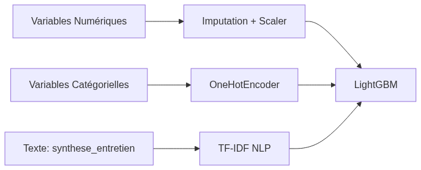

<!-- _class: lead -->
# Projet de Certification IA
## Système d'Orientation et de Prévention du Chômage Longue Durée

**Par Franck Beugnet**
*Conception d'un produit Data de bout en bout (du métier au MLOps)*

---

# Plan de la Soutenance (30 minutes)

1. **Cadrage Métier & Objectifs**
2. **Audit & Ingénierie des Données (Feature Engineering)**
3. **Modélisation & Choix Éthiques (AI Act)**
4. **Architecture Backend & Industrialisation**
5. **Supervision MLOps & Boucle de Rétroaction**
6. **Conclusion & Perspectives (Scale-up)**

---

# 1. Cadrage Métier & Objectifs

---

## Le Constat Métier

- **Contexte :** Flux massif de dossiers lors du premier entretien.
- **Problème :** Difficile d'identifier les demandeurs d'emploi risquant le chômage de longue durée (> 12 mois) avant que les freins périphériques ne s'installent.
- **La Solution IA :** Un outil d'aide à la décision (OAD) analysant les données administratives ET la **note de synthèse textuelle** du conseiller.

<div class="columns">
  <div>
    <div class="tech-box" style="font-size: 20px;">
      <b>Décision Stratégique : L'approche "No Mercy"</b><br>
      L'objectif n'est pas l'Accuracy globale, mais la minimisation absolue des Faux Négatifs (personnes en détresse non détectées). L'algorithme est conçu pour accepter des Faux Positifs au profit d'un Recall élevé sur la classe minoritaire.
    </div>
  </div>
  <div align="center">
    
  </div>
</div>

---

# 2. Audit & Ingénierie des Données

---

## Le Défi du "Small Data" et de la Cardinalité

- **Jeu de données :** Seulement 2500 profils, fortement déséquilibrés (14% de classe positive).
- **Problème technique (Malédiction de la dimensionnalité) :** Garder le `Code Commune INSEE` (2000 modalités) sur 2500 lignes provoquerait un sur-apprentissage (*overfitting*) immédiat.

<div class="tech-box">
<b>Décision Technique : Extraction de Macro-Tendances</b><br>
Troncature du <code>code_insee_commune</code> pour ne garder que le <b>Département</b>. On sacrifie la précision chirurgicale pour forcer l'algorithme à extraire des motifs généralisables.<br>
<b>Limites de notre préparation :</b> En lissant sur le département, on perd la finesse des "bassins d'emplois" ultra-locaux (ex: un pôle industriel dynamique vs sa commune voisine rurale et isolée).
</div>

---

## La Sélection des Variables : Éthique & Biais

L'Âge est un prédicteur mathématique très fort du chômage long (29% chez les seniors vs 9%).

- **Le Risque (Disparate Impact) :** Si on conserve l'âge en phase de préparation, l'IA créera un stéréotype et classera systématiquement les seniors à risque, entraînant une discrimination interdite par l'AI Act.

<div class="tech-box">
<b>Décision Stratégique (Privacy by Design) :</b><br>
Retrait volontaire et total de l'Âge et de la Nationalité dès la préparation des données (*Fairness through Blindness*). Le modèle est forcé de chercher la <i>vraie</i> cause des difficultés (ex: un manque de mobilité) plutôt que d'utiliser la variable "Seniors" comme raccourci discriminatoire.
</div>

---

## Analyse du Texte (NLP) : Problématique et Possibilités

- **La Problématique :** La `synthese_entretien` est un champ libre, non structuré. C'est pourtant là que se cache le vrai signal métier (les freins périphériques, la détresse).
- **Le Défi :** Transformer ce texte stéréotypé et télégraphique en données mathématiques.
- **Les Possibilités techniques :**
  1. *Bag of Words (Comptage)* : Trop simpliste, donne trop de poids aux mots de liaison.
  2. *Deep Learning (CamemBERT / LLM)* : Très puissant pour la sémantique complexe, mais algorithmes dits "Boîte noire".
  3. *TF-IDF (Term Frequency - Inverse Document Frequency)* : Pondère l'importance d'un mot par sa rareté.

---

## Notre Choix : Le TF-IDF (Pourquoi ?)

Nous avons écarté le Deep Learning au profit du **TF-IDF**. 

1. **Obligation Légale (AI Act) :** Le service public exige une explicabilité totale. Avec TF-IDF, chaque mot a un poids mathématique clair. On peut justifier la décision (ex: le mot "dépression" a déclenché l'alerte).
2. **Lutte contre le Sur-apprentissage :** Les notes sont courtes et le volume est faible (2500 lignes). Un réseau de neurones (Deep Learning) aurait mémorisé le jeu de données par cœur.
3. **Green IT & Temps Réel (Principe KISS) :** Le TF-IDF s'exécute sur un simple processeur (CPU) en moins de 0.1 milliseconde, sans nécessiter de serveurs GPU coûteux et énergivores.

---

## Le Pipeline de Traitement (Anti-Fuite de Données)

Pour éviter tout *Data Leakage*, les transformations sont encapsulées dans un pipeline strict de Scikit-Learn exécuté **après** le `train_test_split`.

<div align="center">
  
</div>

*Note : Un `drop='first'` est appliqué sur le OneHotEncoder pour prévenir la colinéarité.*

---

# 3. Modélisation & Choix Éthiques

---

## Gestion du Déséquilibre des Classes

**Le Problème :** 86% des profils sont des "Retours rapides" (Classe 1). Un modèle basique prédisant toujours la Classe 1 aurait 86% d'Accuracy, mais raterait 100% des chômeurs longue durée.

<div class="columns">
  <div>
    <b style="font-size: 20px;">Les Possibilités testées :</b>
    <ul style="font-size: 12px; margin-bottom: 5px;">
      <li><b>Undersampling :</b> Écarté (perte de "signal").</li>
      <li><b>SMOTE :</b> Instable face aux matrices creuses (NLP).</li>
      <li><b>Pondération algorithmique :</b> Sur-pénalise la classe minoritaire.</li>
    </ul>
    <div class="tech-box" style="font-size: 12px; margin-top: 5px; padding: 8px;">
    <b>Notre Choix : La Pondération (`class_weight='balanced'`)</b><br>
    Méthode stable avec le TF-IDF. Couplée au <b>F1-Macro</b>, elle valide notre doctrine d'optimisation du Recall.
    </div>
  </div>
  <div align="center">
    
  </div>
</div>

---

## Le Benchmark : Stratégie de Test
<style scoped> section { font-size: 22px; } </style>

- **Comment on a testé ?** Utilisation d'une validation croisée (5-Fold Cross-Validation) tracée via **MLflow** pour garantir la robustesse statistique.
- **Pourquoi le F1-Macro ?** L'Accuracy est trompeuse (86% de classe 1). Le F1-Macro force le modèle à être performant sur *les deux classes*.
- **Le Duel des Algorithmes :**

| Modèle | Avantage | Inconvénient |
| :--- | :--- | :--- |
| **Régression Logistique** | Rapide, très explicable (Baseline) | Souvent trop simple pour les relations non-linéaires |
| **Random Forest** | Très robuste, performant | Très lent à entraîner sur la matrice creuse du TF-IDF |
| **LightGBM** | Ultra-rapide, optimisation native des matrices creuses | Sensible au sur-apprentissage si mal bridé |

---

## Le Benchmark : Choix et Limites

- **Le Choix Final : LightGBM**. 
  - *Critères de victoire :* Score F1-Macro le plus haut, gestion native des matrices creuses du NLP, et temps d'entraînement extrêmement réduit.
- **Limites de notre expérimentation :** 
  - Le faible volume de données (2500 lignes) nous a empêchés de tester des réseaux de neurones (Deep Learning) qui auraient sur-appris instantanément. 
  - La grille d'optimisation (GridSearch) a dû être volontairement bridée (peu d'hyperparamètres) pour éviter une explosion du temps de calcul.

---

## Optimisation des Hyperparamètres

Une fois l'algorithme choisi (LightGBM), nous avons procédé à son réglage fin (Fine-Tuning) via **GridSearchCV** pour trouver la configuration optimale.

**Objectif principal :** Contrôler la complexité de l'arbre pour éviter le sur-apprentissage (*overfitting*) sur notre petit volume de données.

**Paramètres clés ajustés (Régularisation) :**
- `max_depth = 5` : Limite la profondeur de l'arbre pour l'empêcher d'apprendre des règles trop spécifiques (trop alambiquées).
- `min_child_samples = 50` : Interdit de créer une branche s'il n'y a pas au moins 50 individus concernés. L'algorithme est forcé de chercher des "macro-règles" fiables.

<div class="tech-box">
<b>Le Suivi MLOps :</b> Toutes ces expérimentations et combinaisons de paramètres ont été tracées localement et automatiquement à l'aide de <b>MLflow</b>, nous permettant de retrouver facilement la meilleure itération.
</div>

---

## Explicabilité Locale et Globale (SHAP)

L'utilisation des valeurs de **Shapley (SHAP)** a permis de prouver la pertinence de nos choix :

1. Le mot-clé issu du TF-IDF est très souvent le critère n°1 pour la décision de l'algorithme.
2. Une transparence totale est offerte au conseiller : *"Ce dossier est classé à risque car le modèle a détecté les termes 'frein' et 'mobilité'."*

<div align="center">
  
</div>

---

# 4. Architecture Backend & Industrialisation

---

## De la Modélisation à la Production

Le passage de l'environnement Jupyter vers une API de production robuste.

1. **Sérialisation unifiée :** Le pré-processeur (TF-IDF inclus) et le classifieur sont exportés dans un seul fichier binaire via **Joblib** (contournement des failles de *Pickle*).
2. **Model Card :** Export simultané d'un JSON de métadonnées (hashes, hyperparamètres, F1-score) pour la traçabilité.

---

## L'API FastAPI : Typage et Validation

Création d'une API RESTful (Backend) interrogeable par un frontend (Streamlit).

```python
# Validation stricte des requêtes avec Pydantic
class CandidatIn(BaseModel):
    synthese_entretien: str = Field(..., min_length=10)
    anciennete_mois: int = Field(..., ge=0)
    famille_rome: str = Field(..., max_length=1)
```

**Pourquoi FastAPI ?**
Validation automatique des données entrantes, documentation Swagger embarquée, et très haute performance asynchrone (inférence en ~0.2ms).

---

# 5. Supervision MLOps & Boucle de Rétroaction

---

## Le Monitoring API avec Prometheus & Grafana

<div class="columns">
  <div style="font-size: 24px;">
    L'application est conteneurisée via <b>Docker-Compose</b> avec une instrumentation MLOps native.
    <br><br>
    <ul>
      <li>Exposition des endpoints <code>/metrics</code>.</li>
      <li><b>Dashboard Grafana :</b></li>
      <ul>
        <li>Taux de requêtes / Latence.</li>
        <li>Distribution des prédictions.</li>
        <li>Suivi d'une métrique métier cruciale :<br><b>Le Taux d'Escalade (Fallback)</b>.</li>
      </ul>
    </ul>
  </div>
  <div align="center">
    
  </div>
</div>

---

## Le Fallback : Lutte contre le Biais d'Automatisation

- **Problème UX :** Un conseiller fatigué a tendance à faire confiance aveuglément au feu vert de la machine (Biais d'automatisation).
- **Le Seuil de Rejet (Rejection Threshold) :** 
  - Si l'IA prédit un résultat avec une probabilité **inférieure à 65%**, l'API refuse de se prononcer. 
  - L'interface affiche "Analyse Humaine Requise" (Escalade).
  - Cela remet systématiquement l'humain dans la boucle (*Human-in-the-loop*).

---

## Anticipation : La boucle de rétroaction et le Data Drift

- **Le Paradoxe (Prophétie auto-réalisatrice) :** L'IA détecte un candidat à risque -> On l'aide -> Il trouve un emploi. L'an prochain, le modèle le verra comme une "erreur" de prédiction (Faux Positif). Il est impératif d'enregistrer *le fait qu'il a été aidé* dans le Datalake pour ne pas fausser le futur réentraînement.

<div align="center">
  
</div>

- **Data Drift :** Mise en place planifiée du calcul mensuel du **PSI (Population Stability Index)** pour alerter si le vocabulaire ou les profils des usagers évoluent avec le temps.


---

# 6. Conclusion & Perspectives

---

## Synthèse du Projet

✅ **Un Produit Bout en Bout :** Du nettoyage Pandas jusqu'au conteneur Docker.
✅ **Une Forte Gouvernance Éthique :** Un modèle volontairement bridé pour respecter l'AI Act et éviter le *Disparate Impact*.
✅ **Une Posture MLOps :** Explicabilité SHAP, monitoring Prometheus, sécurité par Fallback.

**Ouverture (Scale-up) :** Si l'outil est déployé sur 1 million d'usagers, la modélisation spatiale brute (Code INSEE) deviendra possible, et l'intégration de modèles sémantiques (LLMs / CamemBERT) justifiée.

---

<!-- _class: lead -->
# Merci de votre attention.
## Place à la démonstration et à vos questions !
