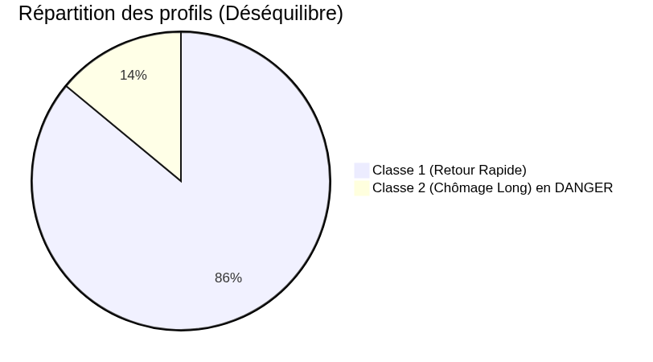
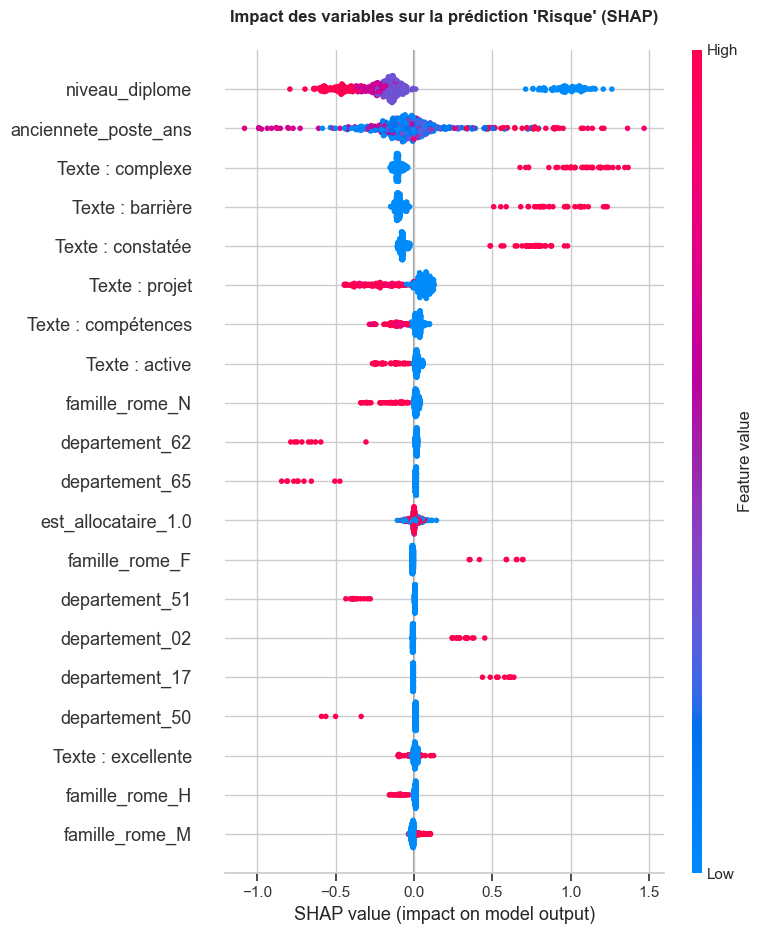
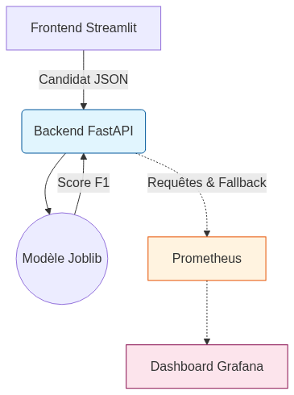
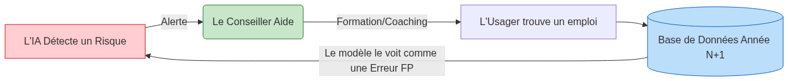

<!-- _class: lead -->

Projet de Certification IA

Système d'Orientation et de Prévention du Chômage Longue Durée

  

    🧑‍💻 Franck Beugnet — Promo ATOS Atlas IA (Parcours 2 : Pros IT)
  

  

    Conception, industrialisation et audit d'un produit Data de bout en bout
  

  Python 3.12
  Scikit-Learn
  LightGBM
  FastAPI
  Streamlit
  MLflow
  Prometheus
  Docker

---

# Plan de la Soutenance (30 minutes cadencées)

  

    

      Partie 1
      ⏱️ 5 min (00:00 - 05:00)
    

    
Cadrage Métier, Éthique & Objectifs

    
Enjeux du guichet, cible à 3 classes, doctrine No Mercy & conformité AI Act.

  

  

    

      Partie 2
      ⏱️ 5 min (05:00 - 10:00)
    

    
Audit, Qualité & Pipeline End-to-End

    
Prétraitements, arbitage NLP TF-IDF vs Deep Learning, étanchéité Scikit-Learn.

  

  

    

      Partie 3
      ⏱️ 7 min (10:00 - 17:00)
    

    
Modélisation, 4 Scénarios & SHAP

    
Benchmark CV, GridSearchCV, audit d'équité S1 à S4, explicabilité locale/globale.

  

  

    

      Partie 4
      ⏱️ 5 min (17:00 - 22:00)
    

    
Architecture Cible, Flux SI & API

    
Flux guichet unique, contrat FastAPI, dimensionnement infra & souveraineté.

  

  

    

      Partie 5
      ⏱️ 5 min (22:00 - 27:00)
    

    
Supervision MLOps & Dérive (Drift)

    
Métrologie Prometheus/Grafana, seuil de repli (65%), alerte précoce (+20%) & audit PSI.

  

  

    

      Partie 6
      ⏱️ 3 min (27:00 - 30:00)
    

    
Bilan Économique & Démonstration

    
ROI financier et sociétal, démo interactive Streamlit & perspectives V2.

  

---

# 1. Cadrage Métier & Objectifs

---

## Le Constat Métier

  <b>Contexte métier :</b> Au sein du service public de l'emploi, le premier entretien d'aiguillage est un moment décisif où le conseiller doit identifier au plus tôt les situations vulnérables afin de mobiliser immédiatement le bon accompagnement.

  

    

      

        🎯 Le Défi Opérationnel au Guichet
      

      <ul style="margin: 0; padding-left: 18px; line-height: 1.35; font-size: 14px;">
        <li style="margin-bottom: 4px;"><b>Flux massif d'usagers :</b> Temps d'échange limité pour déceler les freins périphériques.</li>
        <li style="margin-bottom: 4px;"><b>Solution IA Multimodale :</b> Fusion des critères administratifs et des notes textuelles du conseiller.</li>
        <li><b>Répartition de la cible terrain :</b> 
          • <b>Classe 0 (Rapide &lt; 6m) :</b> 37% <i>(autonomie)</i> 
          • <b>Classe 1 (Moyen 6-12m) :</b> 44% <i>(parcours standard)</i> 
          • <b>Classe 2 (Risque &gt; 12m) :</b> <b style="color: #c62828;">18% (critique)</b>
        </li>
      </ul>
    

    

      <b>Objectif opérationnel :</b> Déclencher l'accompagnement renforcé dès le 1er jour pour éviter l'enlisement dans le chômage longue durée.
    

  

  

    

      ⚖️ Matrice d'Impact Métier & Asymétrie des Coûts
    

<table class="matrix-table">
  <thead>
    <tr>
      <th style="width: 32%; background: transparent; border: none;"></th>
      <th style="background: #e3f2fd; color: #0d47a1; font-weight: bold; font-size: 12.5px;">L'IA prédit "Risque"</th>
      <th style="background: #f5f5f5; color: #424242; font-weight: bold; font-size: 12.5px;">L'IA prédit "Rapide"</th>
    </tr>
  </thead>
  <tbody>
    <tr>
      <td style="background: #ffebee; color: #b71c1c; font-weight: bold; font-size: 12.5px;">
        Réel : Risque Long (Classe 2 — 18%)
      </td>
      <td style="background: #e8f5e9; border: 1.5px solid #2e7d32; color: #1b5e20;">
        <b>Vrai Positif (VP)</b> 
        ✅ Usager orienté & sauvé
      </td>
      <td style="background: #ffebee; border: 2px solid #c62828; color: #b71c1c;">
        <b>Faux Négatif (FN)</b> 
        🚨 DANGER ABSOLU 
        Perte de chance critique
      </td>
    </tr>
    <tr>
      <td style="background: #e8f5e9; color: #1b5e20; font-weight: bold; font-size: 12.5px;">
        Réel : Retour Rapide (Classe 0 — 37%)
      </td>
      <td style="background: #fff8e1; border: 1.5px solid #f57c00; color: #e65100;">
        <b>Faux Positif (FP)</b> 
        ⚠️ Aide inutile 
        Coût financier acceptable
      </td>
      <td style="background: #e8f5e9; border: 1.5px solid #2e7d32; color: #1b5e20;">
        <b>Vrai Négatif (VN)</b> 
        ✅ Usager autonome
      </td>
    </tr>
  </tbody>
</table>

  <b style="color: #b71c1c;">Doctrine "No Mercy" sur le Risque (Priorité au Rappel Classe 2) :</b> 
  Prédire 0 pour un vrai 2 prive l'usager d'aides vitales. Notre modèle sur-pénalise les Faux Négatifs : mieux vaut accompagner préventivement que d'abandonner un usager à risque.

  

---

## Cadre Réglementaire, RGPD & Responsabilité Juridique

  <b>Exigences réglementaires :</b> L'utilisation d'algorithmes prédictifs dans les politiques publiques de l'emploi impose une conformité stricte et vérifiable sur trois piliers juridiques complémentaires.

  

    

      <h4 style="color: #c62828;">1. AI Act Européen</h4>
      

        Classification Haut Risque (Annexe III)
      

      <ul>
        <li><b>Champ d'application :</b> Systèmes d'IA utilisés dans l'emploi, le recrutement et l'orientation.</li>
        <li><b>Exigences :</b> Traçabilité des données d'entraînement, audit des biais, explicabilité formelle.</li>
        <li><b>Obligation clé :</b> <b>Supervision humaine continue</b> (<i>Human-In-The-Loop</i>). Aucune décision automatique sans contrôle.</li>
      </ul>
    

    

      Sanction : jusqu'à 35 M€ ou 7% du CA.
    

  

  

    

      <h4>2. RGPD & Rép. Numérique</h4>
      

        Transparence & Données Sensibles
      

      <ul>
        <li><b>Loi République Numérique :</b> Droit pour l'usager à l'explicabilité individuelle des motifs.</li>
        <li><b>Précision juridique :</b> Âge et nationalité sont des <i>données ordinaires</i> (Art. 4) mais des critères protégés majeurs.</li>
        <li><b>Texte libre surveillé (Art. 9) :</b> Empêcher la captation de données de santé ou handicap.</li>
      </ul>
    

    

      Principe : <i>Privacy by Design</i> (S2).
    

  

  

    

      <h4 style="color: #1b5e20;">3. Responsabilité & Perte de Chance</h4>
      

        Contentieux Administratif
      

      <ul>
        <li><b>Préjudice de l'usager :</b> Un profil vulnérable classé par erreur en "retour rapide" perd ses aides.</li>
        <li><b>Responsabilité publique :</b> Devant le juge administratif, cette <b>perte de chance</b> engage l'État.</li>
        <li><b>Protection par conception :</b> IA qualifiée d'<b>aide consultative</b>. Le conseiller valide souverainement.</li>
      </ul>
    

    

      Garantie : Validation humaine systématique.
    

  

---

# 2. Audit & Ingénierie des Données

---

## Le Défi de la Donnée : "Small Data", Cardinalité & Prétraitement

  <b>Jeu de données & contraintes :</b> 2 500 usagers, 10 variables, valeurs manquantes (âge, diplôme, allocataire, texte). Défi majeur : cardinalité extrême (2 400 communes, 50 métiers) ➔ Risque d'overfitting immédiat.

  

    <h3>1. Feature Engineering (Macro-Tendances)</h3>
    <ul>
      <li><b>Département :</b> 2 premiers chiffres du code INSEE (réduit de 2 400 à ~95 catégories).</li>
      <li><b>Famille ROME :</b> 1ère lettre du code ROME (réduit à 14 grands secteurs).</li>
      <li><b>Compromis assumé :</b> On sacrifie l'hyper-local pour garantir la capacité de généralisation sur 2 500 profils.</li>
    </ul>
  

  

    <h3>2. Variables Numériques (Âge, Ancienneté)</h3>
    <ul>
      <li><b>Cases vides (Imputation) :</b> Remplacement par la valeur médiane pour ne pas être faussé par les cas extrêmes.</li>
      <li><b>Mise à la même échelle (Standardisation) :</b> Ajuste l'âge et les années d'expérience sur un pied d'égalité, évitant qu'un grand chiffre n'écrase les autres données.</li>
    </ul>
  

  

    <h3>3. Catégorielles Ordinales (Diplôme)</h3>
    <ul>
      <li><b>Ordre d'études respecté :</b> Traduction en score croissant selon le niveau : 
        <i>Sans diplôme (0) &lt; Bac (1) &lt; Bac+2 (2) &lt; Bac+5 (3)</i>.</li>
      <li><b>Valeurs manquantes ou imprévues :</b> Remplacées par le diplôme le plus fréquent, avec filet de sécurité si un profil inédit arrive.</li>
    </ul>
  

  

    <h3>4. Catégorielles Nominales (OHE)</h3>
    <ul>
      <li><b>Variables :</b> Allocataire, nationalité, département, famille ROME.</li>
      <li><b>Conversion en cases à cocher (0 ou 1) :</b> Chaque choix devient une option binaire indépendante, sans créer de doublon d'information ni bloquer si une nouvelle option apparaît.</li>
    </ul>
  

  <b>Architecture Scikit-Learn :</b> Toutes ces briques sont isolées dans un <code>ColumnTransformer</code> unifié, combiné au NLP (TF-IDF), garantissant <b>zéro fuite de données (Data Leakage)</b> entre Train et Test.

---

## La Sélection des Variables : Éthique & Biais (AI Act)

  <b>Audit d'Équité & Transparence (AI Act) :</b> L'analyse exploratoire a mis en lumière des disparités structurelles fortes dans les données historiques qu'il est impératif d'auditer et de corriger par conception.

  

    

      <h4 style="color: #c62828;">📊 Biais Historiques Constatés (EDA)</h4>
      <ul>
        <li><b>Âgisme statistique :</b> <b>29% des seniors (45-65 ans)</b> sont en risque long (Classe 2) contre seulement <b>9%</b> des 25-45 ans.</li>
        <li><b>Origine géographique :</b> <b>38% des usagers hors UE</b> sont en risque long contre <b>15%</b> pour les ressortissants de l'Union Européenne.</li>
        <li><b>Indicateur d'équité (Disparate Impact) :</b> Utilisation empirique de la règle des 4/5 de l'EEOC comme signal d'alarme opérationnel face aux déséquilibres.</li>
      </ul>
    

    

      Danger : Un modèle naïf apprendrait à discriminer directement sur l'état civil.
    

  

  

    

      <h4>📋 Gouvernance & Traçabilité des Données</h4>
      <ul>
        <li><b>Datasheet for Datasets (Gebru et al.) :</b> Rédaction d'une fiche d'identité complète du jeu de données dans <code>data/DATASHEET.md</code>.</li>
        <li><b>Objectifs documentés :</b> Motivation de la collecte, composition de l'échantillon, prétraitements appliqués et usages recommandés/interdits.</li>
        <li><b>Conformité AI Act :</b> Traçabilité vérifiable exigée pour tout système classé à Haut Risque.</li>
      </ul>
    

    

      Garantie : Auditabilité complète du cycle de vie de la donnée.
    

  

  <b>Décision Stratégique (Privacy by Design — Scénario S2) :</b> Retrait formel de l'Âge et de la Nationalité pour contraindre l'IA à se baser sur les causes objectives (freins textuels, compétences, secteur ROME). 
  <b>Constat lucide (Échec du <i>Fairness through Blindness</i>) :</b> Les corrélations indirectes (territoire, diplôme) réinjectent un biais résiduel, justifiant le rôle central du conseiller humain.

---

## Analyse du Texte (NLP) : Problématique & Benchmark des Approches

  <b>La Problématique Métier :</b> Le champ libre <code>synthese_entretien</code> est le <b>prédicteur n°1</b> du jeu de données (signaux faibles : <i>"freins périphériques", "perte de confiance", "autonome"</i>). Le défi : convertir ces verbatims hétérogènes en représentations exploitables en temps réel.

  

    

      ❌ Écarté : Trop naïf
      <h3 style="color: #c62828;">1. Bag of Words (Comptage brut)</h3>
      <ul>
        <li><b>Principe :</b> Simple comptage de la fréquence brute des mots.</li>
        <li><b>Limite majeure :</b> Les mots fréquents et vides ("le", "de", "usager") écrasent le signal utile.</li>
        <li><b>Impact :</b> Bruit statistique massif, faible discrimination des situations fragiles.</li>
      </ul>
    

    

      <i>Inadapté aux textes courts et bruités.</i>
    

  

  

    

      ⚠️ Écarté : Surdimensionné
      <h3 style="color: #e65100;">2. Deep Learning (CamemBERT / LLM)</h3>
      <ul>
        <li><b>Principe :</b> Plongements sémantiques contextuels denses (Transformers).</li>
        <li><b>Forces :</b> Analyse fine des nuances linguistiques et des négations.</li>
        <li><b>Obstacles :</b> "Boîte noire" difficilement explicable (AI Act), sur-apprentissage sur 2 500 textes courts, coût GPU prohibitif.</li>
      </ul>
    

    

      <i>À réévaluer sur &gt; 500k textes avec GPU.</i>
    

  

  

    

      ✅ Retenu : Le Compromis Idéal
      <h3 style="color: #1b5e20;">3. TF-IDF avec Stopwords</h3>
      <ul>
        <li><b>Principe :</b> Valorise les mots discriminants et pénalise les termes banals.</li>
        <li><b>Explicabilité totale (AI Act) :</b> Poids direct et traçable pour chaque mot-clé (ex: <i>"barrière", "santé"</i>).</li>
        <li><b>Sobriété (Green IT) :</b> Inférence ultra-rapide (&lt; 0.1 ms sur CPU simple), 0 surcoût infra.</li>
      </ul>
    

    

      <i>Intégration directe dans le ColumnTransformer.</i>
    

  

  <b>Bilan de l'arbitrage NLP :</b> Conformément au principe KISS et aux exigences de transparence publique, le TF-IDF surpasse les modèles complexes en garantissant auditabilité immédiate, sobriété énergétique et robustesse sur un petit corpus.

---

## Le Pipeline Scikit-Learn End-to-End (Anti-Data Leakage)

  

    

      <h4>1. Données Brutes</h4>
      
JSON usager direct

    

    

      INSEE, ROME, Âge, Notes textuelles
    

  

  
➔

  

    

      <h4>2. Feature Eng.</h4>
      
FunctionTransformer

    

    

      Département (95) + Famille ROME (14)
    

  

  
➔

  

    

      <h4>3. Prétraitement</h4>
      
ColumnTransformer

    

    

      Scaler + Ordinal + OHE + TF-IDF
    

  

  
➔

  

    

      <h4>4. Modèle IA</h4>
      
LightGBM Classifier

    

    

      Probabilités [0, 1, 2] + Décision
    

  

  

    <b>🛡️ Zéro Fuite (Data Leakage) :</b> 
    La chaîne est entraînée (<code>fit</code>) strictement sur le jeu d'entraînement après split stratifié. Les statistiques (médianes, échelles, IDF) ne voient jamais le jeu de test.
  

  

    <b>📦 Artefact Unique (555 Ko) :</b> 
    L'intégralité du traitement et de l'estimateur est sérialisée dans <code>pipeline_production.joblib</code>. Finis les scripts annexes de nettoyage en vrac.
  

  

    <b>🚀 Prêt pour la Production :</b> 
    L'API FastAPI reçoit la requête HTTP brute, l'injecte dans le pipeline en 1 ligne (<code>pipeline.predict_proba()</code>) et renvoie la prédiction en <b>&lt; 1 ms</b>.
  

  <b>Garantie logicielle :</b> En encapsulant feature engineering, imputations, encodages et inférence dans un seul objet standardisé, nous éliminons tout écart entre l'expérimentation en notebook et le service déployé en production.

---

# 3. Modélisation, Scénarios & Explicabilité

---

## Le Défi du Déséquilibre : La Réalité des Données

  <b>Constat terrain :</b> Les situations de vulnérabilité extrême ne représentent qu'une minorité des usagers. L'enjeu data science est d'empêcher l'algorithme d'optimiser une performance de façade en ignorant les plus fragiles.

  

    

      <h3 style="color: #c62828;">⚠️ Le Piège de l'Accuracy (81% de fausse réussite)</h3>
      

        Dans un jeu à 3 classes déséquilibré, un modèle paresseux qui prédirait <b>systématiquement un retour rapide ou moyen (0 ou 1)</b> afficherait un taux de bonne prédiction de <b>81%</b>... tout en abandonnant <b>100% des personnes en détresse</b> !
      

    

    

      <h3 style="color: #1b5e20;">🧭 Notre Boussole : Le F1-Score Macro</h3>
      

        Moyenne arithmétique non pondérée des scores F1 des 3 classes :
        

          F1-Macro = (F1_0 + F1_1 + F1_2) / 3
        

        Chaque classe pèse exactement <b>33.3%</b> dans la note finale : si l'IA sacrifie la classe minoritaire à risque (2), le score global s'effondre.
      

    

  

  

    

      📊 Répartition Réelle des Usagers (N = 2 500)
    

    
    

      La <b>Classe 2 (18.4%)</b> requiert un sur-échantillonnage de pénalité (<code>class_weight='balanced'</code>).
    

  

  <b>Règle de conduite MLOps :</b> L'Accuracy globale est formellement bannie comme critère de sélection de nos modèles au profit exclusif du <b>F1-Score Macro</b> et du <b>Rappel sur la Classe 2</b>.

---

## Asymétrie des Coûts : Deux Leviers pour Réduire les Erreurs Critiques

Classer un profil en risque (2) en retour rapide (0) est bien plus grave qu'une fausse alerte. Deux leviers :

  

    <h3>1. En Amont : À l'Entraînement (Cost-Sensitive Learning)</h3>
    <ul>
      <li><b>Pondération automatique — <code>class_weight='balanced'</code> (Retenu) :</b> 
        Chaque profil à risque pèse ~2,4× plus lourd, forçant l'algorithme à ne pas l'ignorer.</li>
      <li><b>Poids personnalisés — <i>Custom Sample Weights</i> :</b> 
        Possibilité de sur-pénaliser davantage les erreurs sur les demandeurs vulnérables.</li>
    </ul>
  

  

    <h3 style="color: #1b5e20;">2. En Aval : À la Décision (Cost-Sensitive Thresholding)</h3>
    <ul>
      <li><b>Seuil d'alerte préventif abaissé — <i>Decision Threshold Tuning</i> :</b> 
        Déclencher l'aide dès 25% de risque détecté, sans attendre une certitude absolue.</li>
      <li><b>Seuil d'abstention (65%) — <i>Rejection Threshold (HITL)</i> :</b> 
        En cas de doute, l'IA passe la main au conseiller humain (<i>Human-in-the-Loop</i>).</li>
    </ul>
  

<b>Synthèse :</b> On combine une pondération à l'apprentissage et un filet d'alerte précoce à la décision pour protéger les usagers fragiles sans alourdir le modèle.

---

## Le Benchmark : Duel sous Validation Croisée Stratifiée

  <b>Méthodologie d'évaluation rigoureuse :</b> 5-Fold Stratified Cross-Validation sur <code>X_train</code> pour préserver strictement la proportion des 3 classes (18% de risque critique). Traçabilité intégrale sous <b>MLflow</b> (paramètres, métriques de chaque pli et courbes).

<table class="bench-table">
  <thead>
    <tr>
      <th style="width: 24%;">Modèle & Famille</th>
      <th style="width: 15%; text-align: center;">F1-Macro CV</th>
      <th style="width: 15%; text-align: center;">Dispersion ($\sigma$)</th>
      <th style="width: 25%;">Atouts Opérationnels</th>
      <th style="width: 21%;">Limites & Risques</th>
    </tr>
  </thead>
  <tbody>
    <tr style="background: #f9fbe7;">
      <td>
        <b>LightGBM</b> 
        Gradient Boosting
        🏆 Top F1
      </td>
      <td style="text-align: center; font-weight: bold; color: #1b5e20; font-size: 14px;">~0.680</td>
      <td style="text-align: center; color: #37474f;">0.014</td>
      <td>Capacité prédictive maximale, gestion native et rapide des matrices creuses TF-IDF</td>
      <td>Risque élevé d'overfitting sur 2 500 profils (nécessite régularisation)</td>
    </tr>
    <tr style="background: #ffffff;">
      <td>
        <b>Random Forest</b> 
        Bagging d'arbres
        🛡️ Top Stabilité
      </td>
      <td style="text-align: center; font-weight: bold; color: #0d47a1; font-size: 14px;">~0.660</td>
      <td style="text-align: center; font-weight: bold; color: #0d47a1;">0.012</td>
      <td>Excellente robustesse aux outliers, décision collective lisse et reproductible</td>
      <td>Artefact lourd en mémoire RAM (&gt; 50 Mo), latence d'inférence plus élevée</td>
    </tr>
    <tr style="background: #fafafa;">
      <td>
        <b>Régression Logistique</b> 
        Linéaire régularisée
        ⚖️ Baseline
      </td>
      <td style="text-align: center; color: #424242; font-size: 13.5px;">~0.664</td>
      <td style="text-align: center; color: #757575;">0.016</td>
      <td>Baseline ultra-rapide, explicabilité directe via les coefficients linéaires</td>
      <td>Rigide : incapable de capturer les interactions croisées complexes (texte × profil)</td>
    </tr>
  </tbody>
</table>

  

    <h4 style="color: #e65100;">🔬 Enseignement du Benchmark</h4>
    Le texte apporte un gain sensible de séparabilité que les arbres de décision exploitent mieux que les modèles linéaires. La Régression Logistique plafonne et est écartée pour l'inférence cible.
  

  

    <h4 style="color: #1b5e20;">🎯 Qualification pour le Duel Final (GridSearchCV)</h4>
    Ne pas éliminer sur paramètres par défaut : qualification conjointe de <b>LightGBM</b> (puissance) et <b>Random Forest</b> (stabilité) pour un réglage fin anti-overfitting monitoré sous MLflow.
  

---

## Optimisation des Hyperparamètres (GridSearchCV + MLflow)

  <b>Duel Final sous MLflow :</b> Exploration systématique par <code>GridSearchCV</code> (5-Fold CV) pour brider le sur-apprentissage induit par les 1 000 features textuelles du TF-IDF sur un petit échantillon (2 500 profils).

  

    <h4>🏆 Réglages Retenus — LightGBM (Vainqueur du Duel)</h4>
    <table class="param-table">
      <tr>
        <td style="width: 42%;"><code>n_estimators = 100</code></td>
        <td>Nombre d'arbres maîtrisé pour fixer les règles générales sans bruit.</td>
      </tr>
      <tr>
        <td><code>learning_rate = 0.05</code></td>
        <td>Vitesse douce (vs 0.1 par défaut) forçant une correction prudente.</td>
      </tr>
      <tr>
        <td><code>num_leaves = 15</code></td>
        <td>Limite le nombre de feuilles (au lieu de 31) pour contrer la dimensionnalité.</td>
      </tr>
      <tr>
        <td><code>min_child_samples = 20</code></td>
        <td><b>Anti-par cœur :</b> interdit toute règle s'appliquant à moins de 20 usagers.</td>
      </tr>
      <tr>
        <td><code>class_weight = 'balanced'</code></td>
        <td>Sur-pénalise les erreurs sur la classe 2 (poids $\times 2.4$) contre le déséquilibre.</td>
      </tr>
    </table>
  

  

    

      <h4>📊 Arbitrage Automatisé MLflow</h4>
      

        • <b>LightGBM :</b> F1-Macro CV optimisé à <b>~0.70</b> avec une inférence &lt; 0.5 ms. 
        • <b>Random Forest :</b> F1-Macro CV à ~0.67, éliminé pour lourdeur mémoire et moindre captation des signaux TF-IDF. 
        • <b>Traçabilité :</b> Artefacts, hyperparamètres et signatures sérialisés sous <code>mlflow.sklearn</code>.
      

    

    

      ✅ Sélectionné comme moteur de prédiction pour les 4 scénarios d'audit.
    

  

  <b>Gouvernance MLOps & Limite assumée (POC) :</b> Hyperparamètres calés sur le jeu complet pour comparer équitablement les scénarios sans biaiser par le tuning. En V2 industrielle, un <code>GridSearchCV</code> dédié au scénario S2 sera exécuté avant mise en production.

---

## Analyse Comparée des 4 Scénarios 

  <b>Audit d'impact des modalités de données :</b> Évaluation sur le jeu de test ($N = 500$) de l'impact des données sensibles (RGPD) et de l'apport respectif du texte et des données administratives.

<table class="scen-table">
  <thead>
    <tr>
      <th style="width: 17%;">Scénario</th>
      <th style="width: 27%;">Périmètre des Features</th>
      <th style="width: 11%; text-align: center;">F1-Macro</th>
      <th style="width: 12%; text-align: center;">Erreurs FN (C2)</th>
      <th style="width: 15%; text-align: center;">Disparate Impact</th>
      <th style="width: 18%; text-align: center;">Arbitrage</th>
    </tr>
  </thead>
  <tbody>
    <tr style="background: #fafafa;">
      <td><b>S1 (Complet)</b></td>
      <td>Tabulaire + Texte + Âge + Nationalité</td>
      <td style="text-align: center; font-weight: bold; color: #455a64; font-size: 17.5px;">0.716</td>
      <td style="text-align: center; font-weight: bold; color: #1b5e20; font-size: 17.5px;">24</td>
      <td style="text-align: center; color: #c62828; font-weight: 600;">2.53 (Biais fort)</td>
      <td style="text-align: center;">❌ Non conforme</td>
    </tr>
    <tr style="background: #f9fbe7; border: 2.5px solid #2e7d32;">
      <td><b>S2 (Éthique)</b></td>
      <td>S1 <b>sans âge ni nationalité</b></td>
      <td style="text-align: center; font-weight: bold; color: #1b5e20; font-size: 18.5px;">0.627</td>
      <td style="text-align: center; font-weight: bold; color: #d84315; font-size: 18.5px;">33</td>
      <td style="text-align: center; color: #e65100; font-weight: 600;">1.41 (Proxy résiduel)</td>
      <td style="text-align: center;">🏆 Retenu Prod</td>
    </tr>
    <tr style="background: #ffffff;">
      <td><b>S3 (NLP seul)</b></td>
      <td>Synthèse entretien seule (TF-IDF)</td>
      <td style="text-align: center; color: #37474f; font-size: 17.5px;">0.637</td>
      <td style="text-align: center; color: #e65100; font-size: 17.5px;">32</td>
      <td style="text-align: center; color: #e65100; font-weight: 600;">1.62 (Biais verbatims)</td>
      <td style="text-align: center;">⚠️ Trop fragile</td>
    </tr>
    <tr style="background: #fafafa;">
      <td><b>S4 (Tabulaire)</b></td>
      <td>Données contextuelles (sans texte)</td>
      <td style="text-align: center; color: #757575; font-size: 17.5px;">0.614</td>
      <td style="text-align: center; color: #c62828; font-size: 17.5px;">39</td>
      <td style="text-align: center; color: #c62828; font-weight: 600;">2.40 (Biais indirect)</td>
      <td style="text-align: center;">❌ Aveugle freins</td>
    </tr>
  </tbody>
</table>

  

    <h4 style="color: #1b5e20;">🛡️ Le "Coût de l'Éthique" (Prime d'assurance)</h4>
    Passer de S1 à S2 coûte <b>9 erreurs critiques de plus</b> (33 FN vs 24). C'est un compromis assumé face au risque juridique : ce différentiel est absorbé par le <b>filet d'escalade humaine (HITL)</b>.
  

  

    <h4 style="color: #e65100;">⚖️ L'illusion du « Fairness through Blindness »</h4>
    Même sans âge ni nationalité, S2 conserve un Disparate Impact de <b>1.41</b>. Les <b>variables proxy</b> (département, diplôme) réinjectent un biais résiduel, rendant l'arbitrage humain indispensable.
  

---

## Explicabilité Locale et Globale (SHAP sur S2)

  <b>Audit d'Interprétabilité (AI Act Art. 13) :</b> Décomposition des décisions par valeurs de Shapley (<code>TreeExplainer</code>) sur S2. Chaque prédiction devient explicable et justifiable.

  

    

      <h4>🔍 Enseignements Clés du Summary Plot</h4>
      <ul>
        <li><b>Ancienneté au dernier poste :</b> Socle n°1. Les points rouges à droite indiquent qu'une forte ancienneté tire vers le <b>risque long (+SHAP)</b>.</li>
        <li><b>Mots-clés textuels décisifs :</b> Des termes comme <i>"santé", "barrière", "complexe"</i> ou <i>"isolé"</i> agissent comme des déclencheurs d'alerte.</li>
        <li><b>Absence de biais direct :</b> Preuve visuelle que l'âge et la nationalité sont totalement absents des facteurs d'influence.</li>
      </ul>
    

    

      <b>Explicabilité Locale (Streamlit) :</b> Graphique en cascade (<i>Waterfall plot</i>) unitaire pour chaque dossier, offrant au conseiller un argumentaire opposable.
    

  

  

    

      📊 Summary Plot SHAP (Classe 2 - Risque)
    

    
    

      Rouge = Valeur élevée · Bleu = Valeur basse
    

  

  <b>Garantie de transparence :</b> L'algorithme n'est plus une boîte noire. Le conseiller dispose pour chaque usager des 3 critères prépondérants motivant la décision.

---

# 4. Architecture Backend & Industrialisation

---

## De la Modélisation au Déploiement API (FastAPI & Pydantic)

  <b>Passage en production :</b> L'artefact sérialisé <code>pipeline_production.joblib</code> (555 Ko) et sa <b>Model Card</b> (<code>pipeline_production.json</code>) sont exposés via un microservice <b>FastAPI</b> asynchrone, typé et testé (Pytest).

  

    

      <h4>🔌 Contrat d'Interface & Routes RESTful</h4>
      <table class="routes-table">
        <tr>
          <td style="width: 44%;"><code>GET /health</code></td>
          <td>Contrôle de santé du service et présence du modèle en RAM.</td>
        </tr>
        <tr>
          <td><code>POST /predict</code></td>
          <td>Inférence unitaire, probabilités et décision de <b>Fallback (&lt; 65%)</b>.</td>
        </tr>
        <tr>
          <td><code>POST /predict/batch</code></td>
          <td>Traitement de masse pour l'alimentation nocturne du SI.</td>
        </tr>
        <tr>
          <td><code>POST /train</code></td>
          <td>Réentraînement tracé sous MLflow sécurisé par <code>X-API-Key</code>.</td>
        </tr>
      </table>
    

  <b>Robustesse par conception :</b> Validation stricte Pydantic à l'entrée. Tout champ aberrant (ancienneté &lt; 0, code INSEE $\neq$ 5 car.) renvoie immédiatement une erreur <code>422 Unprocessable Entity</code> documentée.

  

  

    

      <h4 style="color: #00796b;">🛡️ Validation de Schéma Pydantic</h4>
      

class UsagerInput(BaseModel): 
&nbsp;&nbsp;anciennete_poste_ans: float = Field(..., ge=0, le=50) 
&nbsp;&nbsp;niveau_diplome: str 
&nbsp;&nbsp;code_insee_commune: str = Field(..., min_length=5, max_length=5) 
&nbsp;&nbsp;code_rome_vise: str = Field(..., min_length=5, max_length=5) 
&nbsp;&nbsp;est_allocataire: int = Field(..., ge=0, le=1) 
&nbsp;&nbsp;synthese_entretien: str = Field(default="")
      

    

    

      ⚡ <b>Performance CPU :</b> Temps d'inférence moyen <b>&lt; 1 ms</b>, parfaitement transparent pour un conseiller en entretien de face-à-face.
    

  

  <b>Qualité logicielle :</b> 6 tests d'intégration automatisés (<code>test_api.py</code>, <code>test_pipeline.py</code>) vérifient le rejet d'entrées corrompues et la conformité des prédictions avant tout déploiement.

---

## Intégration SI, IHM Conseiller & CI/CD Docker

  <b>Urbanisation du SI & Déploiement :</b> L'application métier s'insère sans rupture dans l'environnement du conseiller, hébergée sur Cloud souverain et industrialisée par un pipeline CI/CD reproductible.

  

    <b style="font-size: 14px; color: #0d47a1;">1. UI Streamlit</b> 
    Saisie profil & notes
  

  
➔

  

    <b style="font-size: 14px; color: #1b5e20;">2. API FastAPI (CPU)</b> 
    Inférence S2 &lt; 1 ms
  

  
➔

  

    <b style="font-size: 14px; color: #bf360c;">3. Décision & Explication</b> 
    Jauge 65% + SHAP
  

  
➔

  

    <b style="font-size: 14px; color: #37474f;">4. BDD & Guichet</b> 
    Traçabilité décision
  

  

    

      <h4>🖥️ Expérience Conseiller & Cloud Souverain</h4>
      <ul>
        <li><b>Ergonomie & Décision :</b> Code couleur métier (Vert, Orange, Rouge) + alerte visuelle si certitude &lt; 65% (relais humain immédiat).</li>
        <li><b>Explicabilité intégrée :</b> Restitution des 3 causes majeures (SHAP waterfall) directement sur le poste agent.</li>
        <li><b>Cloud Souverain (SecNumCloud) :</b> Hébergement français (OVHcloud / Outscale) assurant élasticité et confidentialité des données publiques de l'emploi.</li>
      </ul>
    

    

      Garantie : Outil consultatif préservant la souveraineté de l'agent public.
    

  

  

    

      <h4 style="color: #1b5e20;">🚀 Pipeline CI/CD & Déploiement Reproductible</h4>
      <ul>
        <li><b>GitHub Actions sur <code>master</code> :</b> Linting automatique (<code>flake8</code>, <code>black</code>) + 6 tests unitaires/intégration Pytest.</li>
        <li><b>Image Docker optimisée :</b> Multi-stage build Python 3.12-slim (&lt; 300 Mo), sécurité non-root, sans cache de build.</li>
        <li><b>Stack complet :</b> <code>docker compose up</code> monte en 1 commande FastAPI, Streamlit, Prometheus et Grafana.</li>
      </ul>
    

    

      Garantie : Zéro régression, 100% reproductible du code à la production.
    

  

---

# 5. Supervision MLOps & Amélioration Continue

---

## Le Monitoring en Temps Réel (Prometheus & Grafana)

  <b>Supervision continue en production :</b> Stack intégrée dans <code>docker-compose.yml</code> associant <b>Prometheus</b> (métriques temps réel), <b>Grafana</b> (tableaux de bord) et <b>MLflow</b> (registre de modèles).

  

    

      <h4 style="color: #0d47a1;">⚙️ Métriques Système (Disponibilité & SLAs)</h4>
      <ul>
        <li><b>Latence d'inférence (p95) :</b> Temps de réponse &lt; 100 ms sous charge.</li>
        <li><b>Disponibilité & Codes HTTP :</b> Taux d'erreurs 5xx (&lt; 0.01%) et rejets Pydantic 422.</li>
        <li><b>Ressources :</b> Consommation CPU/RAM de l'API (empreinte &lt; 200 Mo).</li>
      </ul>
    

    

      <h4 style="color: #1b5e20;">🎯 Métriques Métier & Santé du Modèle</h4>
      <ul>
        <li><b>Distribution des prédictions :</b> Suivi des parts relatives (Classes 0, 1, 2) pour détecter les bascules anormales de population.</li>
        <li><b>Confiance du modèle :</b> Histogramme glissant des probabilités maximales.</li>
        <li><b>Taux d'escalade humaine (Fallback) :</b> Part de dossiers où la certitude est &lt; 65% (nominal : ~38-40%).</li>
      </ul>
    

  

  

    

      🏗️ Architecture de Métrologie Conteneurisée
    

    
    

      FastAPI expose <code>/metrics</code> ➔ Scraped par Prometheus ➔ Grafana
    

  

  <b>Principe MLOps :</b> Le monitoring ne se limite pas aux pannes serveur ; il surveille en continu la pertinence décisionnelle de l'IA pour garantir un service public équitable.

---

## Filet Humain (Seuil 65%) & Alerte Dérive Précoce (+20%)

  <b>Garde-fou éthique & Détection temps réel :</b> La vérité terrain (retour à l'emploi) n'étant connue qu'à 6-12 mois, le <b>seuil de rejet à 65%</b> protège l'usager et sert d'<b>indicateur avancé de dérive</b> immédiat.

  

    

      <h4 style="color: #0d47a1;">🛡️ Seuil de Rejet à 65% (Anti-Biais d'Automatisation)</h4>
      <ul>
        <li><b>Calibration imparfaite :</b> Les scores <code>predict_proba</code> du LightGBM ne sont pas des probabilités pures (Brier Score = 0.48). Le seuil agit en filtre opérationnel.</li>
        <li><b>Bascule empirique mesurée :</b> 
          • Score $\ge$ 65% : <b>76% d'exactitude</b> (recommandation fiable). 
          • Score &lt; 65% : <b>46% d'exactitude</b> (l'IA doute ➔ abstention).</li>
      </ul>
      

        

          <b>🟢 Confiance $\ge$ 65% :</b> L'IHM affiche le conseil au conseiller.
        

        

          <b>🟡 Confiance &lt; 65% :</b> <code>fallback: true</code>, l'agent décide souverainement.
        

      

    

  

  

    

      <h4 style="color: #bf360c;">🚨 Alerte Dérive (+20% relatif) & Playbook MLOps</h4>
      <ul>
        <li><b>Taux nominal de fallback :</b> En rythme de croisière, ~38-40% des dossiers sont sous 65%.</li>
        <li><b>Signal précoce (+20%) :</b> Si le taux de rejet dépasse <b>48% sur 4 semaines glissantes</b>, c'est une dérive structurelle (choc économique, changement de verbatims).</li>
      </ul>
      

        <b>Playbook d'action gradué :</b> 
        1. <b>Contrôle PSI :</b> Identifier les variables d'entrée ayant dérivé. 
        2. <b>Recalibration :</b> Ajuster les scores (Platt/isotonique) sans réentraîner. 
        3. <b>Réentraînement ciblé :</b> Appel <code>POST /train</code> si le drift persiste.
      

    

  

  <b>Bénéfice majeur :</b> Grâce au taux de fallback, l'administration est alertée dès la 3ᵉ semaine d'une anomalie de modèle, sans devoir attendre un an le constat d'échec sur le terrain.

---

## Cycle de Vie : Boucle de Rétroaction & Dérive (Drift)

  <b>Pérénité du produit IA :</b> Éviter le piège de la prophétie auto-réalisatrice lors des réentraînements et superviser mathématiquement la dérive de distribution des données entrantes.

  

  

    <h4 style="color: #b71c1c;">🔄 Le Piège de la Prophétie Auto-Réalisatrice</h4>
    Si un usager classé <i>Risque long</i> retrouve un emploi en 4 mois grâce à l'aide renforcée, le modèle naïf le requalifie en "retour rapide" lors du réentraînement et désapprend son utilité ! 
    ➔ <b>Solution par conception :</b> Enregistrement obligatoire de la variable <code>a_beneficie_aide_renforcee</code> pour isoler l'effet causal de l'accompagnement.
  

  

    <h4 style="color: #1b5e20;">📈 Surveillance Mathématique du Data Drift (PSI)</h4>
    Calcul mensuel du <b>Population Stability Index (PSI)</b> sur les entrées : 
    • $PSI &lt; 0.10$ : Distribution stable. 
    • $0.10 \le PSI \le 0.20$ : Dérive modérée sous surveillance. 
    • <b>$PSI &gt; 0.20$ : Dérive critique</b> (déclenchement automatique du réentraînement supervisé sous MLflow).
  

---

# 6. Bilan Économique, Perspectives & Conclusion

---

## Comparatif Économique & ROI (FinOps & Métier)

  <b>Arbitrage Valeur & Sobriété :</b> La viabilité d'un projet IA en service public repose sur deux piliers : la frugalité d'infrastructure (FinOps) et la maximisation du retour sur investissement humain et social.

  

    

      <h4 style="color: #0d47a1;">⚡ Frugalité Numérique & FinOps (CPU vs GPU)</h4>
      <ul>
        <li><b>Empreinte RAM minime :</b> Pipeline complet &lt; 200 Mo en mémoire vive.</li>
        <li><b>Inférence ultra-rapide sur CPU :</b> Temps de réponse moyen &lt; 1 ms, sans recourir à des accélérateurs matériels énergivores.</li>
        <li><b>Économie directe &gt; 80% :</b> Zéro dépendance aux clusters GPU coûteux nécessaires aux LLMs ou architectures Transformers lourdes.</li>
      </ul>
    

    

      🌱 Alignement Green IT & sobriété budgétaire publique.
    

  

  

    

      <h4 style="color: #1b5e20;">⚖️ L'Économie de l'Erreur & Limites du Rappel</h4>
      <ul>
        <li><b>Faux Positif (Sur-accompagnement) :</b> Coût marginal = un entretien approfondi de 30 min (~25€ de temps conseiller).</li>
        <li><b>Faux Négatif (Risque long ignoré) :</b> Coût sociétal majeur = 12 à 24 mois d'allocation et rupture sociale (<b>&gt; 15 000€</b>).</li>
        <li><b>Pourquoi ne pas viser 95% de Rappel ?</b> 
          Forcer 95% ferait s'effondrer la précision (explosion des faux positifs), saturant les dispositifs renforcés, débordant les conseillers et diluant l'aide pour les vrais cas critiques.</li>
      </ul>
    

    

      🎯 Arbitrage réaliste : protection maximale sans saturer les capacités d'accueil.
    

  

  <b>Synthèse économique & opérationnelle :</b> En combinant un coût machine quasi nul et un rappel équilibré (~75-80%), notre modèle protège les demandeurs vulnérables tout en restant soutenable pour les agents et le budget public.

---

## Perspectives de Passage à l'Échelle (Scale-up)

  <b>Trajectoire d'industrialisation (Scale-up) :</b> Feuille de route technique pour faire évoluer le système du cadre expérimental (2 500 usagers) vers un déploiement national à grande échelle (1 million de profils).

<table class="scale-table">
  <thead>
    <tr>
      <th style="width: 22%;">Dimension Clé</th>
      <th style="width: 38%;">Échelle MVP (2 500 profils) — Actuel</th>
      <th style="width: 40%;">Échelle Nationale (1 000 000 profils) — Cible</th>
    </tr>
  </thead>
  <tbody>
    <tr style="background: #fafafa;">
      <td><b>Données Territoriales</b></td>
      <td>Agrégation par département (anti-overfitting)</td>
      <td>Exploitation du code commune INSEE brut (bassins d'emploi fins)</td>
    </tr>
    <tr style="background: #f9fbe7;">
      <td><b>Traitement NLP</b></td>
      <td>TF-IDF avec stop words (léger, explicable, CPU)</td>
      <td>Embeddings sémantiques CamemBERT fins avec surcouche LIME/SHAP</td>
    </tr>
    <tr style="background: #ffffff;">
      <td><b>Pipeline MLOps</b></td>
      <td>SQLite MLflow local + Docker-Compose</td>
      <td>Feature Store (Feast), Registry MLflow distribué & monitoring continu</td>
    </tr>
  </tbody>
</table>

  

    <h4 style="color: #0d47a1;">🗺️ Granularité Géographique & Bassins d'Emploi</h4>
    Avec un volume massif, la cardinalité INSEE devient un atout prédictif majeur plutôt qu'un risque de mémorisation par cœur, permettant de modéliser les dynamiques de l'emploi bassin par bassin.
  

  

    <h4 style="color: #1b5e20;">🧠 Richesse Sémantique & Modèles de Langage</h4>
    Sur 500 000 verbatims, un modèle de type CamemBERT capte les tournures subtiles et les négations tout en restant auditable grâce aux bibliothèques d'explicabilité post-hoc.
  

---

## Conclusion & Bilan de la Soutenance

  <b>Bilan Synthétique du Projet :</b> Réalisation complète, robuste et éthique d'un produit d'IA d'aide à la décision pour le service public de l'emploi, prêt pour l'expérimentation terrain.

  

    

      <h4 style="color: #0d47a1;">🚀 Produit End-to-End</h4>
      <ul>
        <li><b>Chaîne complète :</b> Du cadrage métier et audit des données jusqu'à l'inférence.</li>
        <li><b>Microservices :</b> API FastAPI asynchrone, UI Streamlit ergonomique et conteneurs Docker.</li>
        <li><b>Reproductibilité :</b> Pipeline CI/CD GitHub Actions automatisé (100% testé).</li>
      </ul>
    

    

      ✅ Livrable déployable en 1 commande.
    

  

  

    

      <h4 style="color: #1b5e20;">🛡️ Éthique & AI Act</h4>
      <ul>
        <li><b>Privacy by Design :</b> Retrait préventif de l'âge et de la nationalité (Scénario S2).</li>
        <li><b>Explicabilité totale :</b> Décomposition unitaire et collective SHAP intégrée à l'IHM.</li>
        <li><b>Human-In-The-Loop :</b> Seuil de repli à 65% préservant la souveraineté de l'agent public.</li>
      </ul>
    

    

      ✅ Conforme aux normes Haut Risque.
    

  

  

    

      <h4 style="color: #bf360c;">💡 Sobriété & Métier</h4>
      <ul>
        <li><b>Frugalité Green IT :</b> Inférence ultra-rapide &lt; 1 ms sur simple CPU sans GPU coûteux.</li>
        <li><b>Doctrine métier :</b> Priorité absolue au rappel classe 2 pour éradiquer les abandons.</li>
        <li><b>Supervision MLOps :</b> Détection précoce du drift via le taux de fallback et le PSI.</li>
      </ul>
    

    

      ✅ Impact public et budgétaire maximisé.
    

  

  <b>Message de conclusion :</b> L'intelligence artificielle au service de l'emploi n'a de valeur que si elle conjugue rigueur mathématique, humilité éthique et intégration fluide au service des conseillers humains.

---

<!-- _class: lead -->
# Merci de votre attention.
